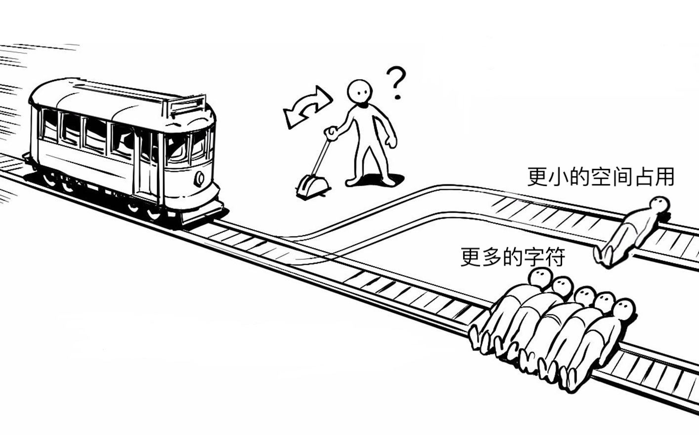

## 导语

这，是一个字符串

	
	smile 😊

由于你的计算机只能识别 `0` 和 `1` 这样的数字，为了让它读懂这个字符串，需要建立字符串中的每个字符到特定内容的**映射 (Mapping)**.

  

于是，ASCII、GBK、BIG-5、UTF-32、UTF-16、UTF-8等编码应运而生。它们基于对应的**字符集 (Charset)**，将其中**字符 (Character)** 与 **码点 (Code Point)** 之间的映射关系，进一步实现为**字符**与**计算机储存、传输内容**（如二进制数、电脉冲）的映射关系，让我们得以在计算机上使用我们的语言.

  

为了更好地了解现代计算机所使用的编码规则，我们先从 **ASCII** 开始.

<!--truncate-->

  

## ASCII

**ASCII**  *[/ˈæski/]* (**A**merican **S**tandard **C**ode for **I**nformation **I**nterchange) 是基于拉丁字母的一套电脑编码系统，由 **ANSI** (**A**merican **N**ational **S**tandards **I**nstitute) 于1967年推出，作为计算机及其他设备的文本字符编码标准。它主要用于显示现代英语，其拓展版本 **EASCII** 则可以部分支持其他西欧语言，并等同于国际标准 [ISO/IEC646](https://zh.m.wikipedia.org/zh-hans/ISO/IEC_646).

  

**ASCII** 支持的字符包括：

  

阿拉伯数字：

	0123456789

小写英文字符：

	abcdefghijklmnopqrstuvwxyz

大写英文字母：

	ABCDEFGHIJKLMNOPQRSTUVWXYZ

常用英文符号：

	!"#$%&\'()*+,-./:;<=>?@[\]^_`{|}~

控制字符（负责对应换行、回车等特殊的控制功能）：

	NUL SOH STX ETX EOT ENQ ACK BEL...

  

之所以说**ASCII**支持了如上的字符，源自于其所支持字符与**码点 (Code Point)** 之间的映射关系，如下表：

|码点| 字符 |码点| 字符 |码点| 字符 |码点| 字符 |码点| 字符 |码点| 字符 |码点|字符|码点|字符|
|--|--|--|--|--|--|--|--|--|--|--|--|--|--|--|--|
|0 | NUL |1 | SOH |2 | STX |3 | ETX |4 |EOT |5 | ENQ |6 |ACK|7 |BEL |
|8 | BS|9 | HT |10 | LF |11| VT |12 | FF |13 | CR |14 | SO |15 | SI |
|16 | DLE |17 | DC1 |18 | DC2 |19 | DC3 |20 | DC4 |21 | NAK |22 | SYN |23 | ETB |
|24 | CAN |25 | EM |26 | SUB |27 | ESC |28 | FS |29 | GS |30 | RS |31 | US |
|32 |(space) |33 | ! |34 | " |35 | # |36 | $ |37 | % |38 | & |39 | ' |
|40 | ( |41 | ) |42 | * |43 | + |44 | , |45 | - |46 | . |47 | / |
|48 | 0 |49 | 1 |50 | 2 |51 | 3 |52 | 4 |53 | 5 |54 | 6 |55| 7 |
|56 | 8 |57 | 9 |58 | : |59 | ; |60 | < |61 | = |62 | > |63 | ? |
|64 | @ |65 | A |66 | B |67 | C |68 | D |69 | E |70 | F |71 | G |
|72 | H |73 | I |74 | J |75 | K |76 | L |77 | M |78 | N |79 | O |
|80 | P |81 | Q |82 | R |83 | S |84 | T |85 | U |86 | V |87 | W |
|88 | X |89 | Y |90 | Z |91 | [ |92 | \ |93| ] |94 | ^ |95 | _ |
|96 | ` |97 | a |98 | b |99 | c |100 | d |101 | e |102 | f |103 | g |
|104 | h |105 | i |106 | j |107 | k |108 | l |109 | m |110 | m |111 | o |
|112 | p |113 | q |114| r |115 | s |116 | t |117 | u |118 | v |119 | w |
|120 | x |121 | y |122 | z |123 | { |124 | \| |125 | } |126 | ~ |127 | DEL |

  

*如果对于控制字符的作用感兴趣，可以点击[这里](https://zh.wikipedia.org/wiki/%E6%8E%A7%E5%88%B6%E5%AD%97%E7%AC%A6#?proca&luy)了解*.

  

到目前为止，你也许觉得奇怪：建立十进制的码点与字符之间的映射关系，到底如何有助于计算机储存字符呢？

  

有这样的疑问很正常，因为上表中我们所讨论的只是ASCII**字符集 (Charset)**，而非ASCII**字符编码 (Character encoding)**。前者只是字符及其对应码点的集合，不代表字符一定会以对应码点被储存在计算机中，后者才真正定义了字符到计算机储存内容的映射.

  

ASCII字符编码采用了最简单的编码规则：将ASCII字符集内各个字符所对应的码点，以二进制形式储存在计算机中.

  

由于ASCII只包括128个字符，使用7个二进制位足以表示其所有字符。然而，计算机通常以**字节(Byte)** 为基本单位进行读写操作，而单位字节中包括8个**位(Bit)**，亦即8个二进制位。因此，为了方便计算机读写，ASCII字符编码会在码点对应二进制数开头留上一个`0`.

  

因此实际上，以我们开头所提到的字符串`smile 😊` 为例，ASCII字符编码长这样：

 （请注意：字符串中含有一个空格）
 
|码点| 字符 |二进制码点|储存在计算机中的内容|
|--|--|--|--|
|115 | s | 111 0011 | 0111 0011 |
|109 | m | 110 1101 | 0110 1101 |
|105 | i | 110 1001 | 0110 1001 |
|108 | l | 110 1100 | 0110 1100 |
|101 | e | 110 0101 | 0110 0101 |
|32 |   | 010 0000 | 0010 0000 |
|？ | 😊 | ？ |？ |

  

看起来很完美，不是吗？

  

才怪！在上表中，我们无法使用ASCII字符编码表示emoji `😊` ！并且，不仅仅是emoji，法语中的重音符(如：à, è, ù)、长音符(如：â, ê, î, ô, û)……，以及日语、中文……

总之，在美式英语使用场景之外，ASCII字符编码都让人捉襟见肘.

  

为了在计算机上使用本地区的语言，不同国家和地区都开始制定属于自己的编码标准.

在中国大陆，有**GB2312**(其拓展版本为**GBK**)，使用区位码来记录字符，并向下兼容ASCII；在港澳台地区，有被称作**大五码(Big5)**的字符集业界标准；在日本，有Shift JIS编码表……

  

设想一下：在拥有224个国家与地区的地球上，如果每个地区都只是使用自己地区的独特字符集，地区之间的交流将会有多么麻烦！

  

为了让你感同身受，我们来看一个例子：

你在你的电脑上使用`Visual Studio Code`编辑代码时，“不小心”地将默认编码设置为**GBK**，在你的编辑器中，一切显示正常——无论是代码还是中文注释。但当你将该文件发送给你的同事后，不出意外地，你的同事会发现代码中的注释全是些看不懂的文字！

  

原因就在于`Visual Studio Code`的默认编码为**UTF-8**（我们稍后会介绍）而非**GBK**。储存在计算机中的二进制内容，依据不同的编码标准打开时，呈现的内容截然不同！

  

为了解决这类问题，人们需要一种更通用、支持更多语言的字符集。1991年，**Unicode 字符集**发布，每个人都能在支持Unicode的设备上阅读自己的文字。经过多个版本的迭代，Unicode字符集的囊括范围，已由初代的**7161**个字符(1991年)，扩大到如今的**144,697**个字符(2021年).

  

现在，我们来详细了解一下**Unicode字符集**及其对应的各种字符编码.

## Unicode

如上所述，**Unicode字符集**如今囊括了144,697个字符，即拥有144,697个字符与码点之间的映射关系，数量远远大于**ASCII字符集**所支持的128个字符。而要在计算机上正常使用数量如此庞大的Unicode字符集，仍需实现字符到计算机储存内容的**映射关系**.

与**ASCII字符集**不同，**Unicode字符集**拥有不止一种编码格式：有些编码格式原理十分简单粗暴，有些编码格式则稍加灵活与技巧。现在，请你思考一下：如果由你制定Unicode字符集的编码格式，基于Unicode字符集**庞大**的字符数量，你会如何做？

你可能会想：“哎呀这不简单嘛，直接以码点的二进制形式存进去不就好了嘛！”

接下来，让我们探讨一下这种方案的可行性.

## 尝试制定基于Unicode字符集的字符编码

还是以我们开头提到的字符串`smile 😊`为例.

首先，我们需要知道该字符串中各个字符在Unicode字符集中的码点，才能将其转换为二进制数。但**Unicode字符集**可不像**ASCII字符集**那样仅仅有**128**个字符——只靠肉眼查表就能轻松找到目标。因此，对于普通人来说，查询Unicode字符码点最简单的方式是通过网络；但作为一名程序员，我们还有更优雅的方式：

尝试在`Google Chrome`开发者工具的 *console* 中输入以下代码：

    "s".codePointAt();

期望的输出如下：

    115

（在Javascript中，通过调用字符串的`codePointAt()`方法，可以获取字符串中**首字符**在Unicode中的码点）

下一步，将码点转换为二进制。同样地，作为程序员，在这一步我们也有更优雅的实现方式：

同样尝试在`Google Chrome`开发者工具的 *console* 中输入以下代码：

    "s".codePointAt().toString(2);

期望的输出如下：

    '1110011'
    
（在Javascript中，通过调用数字**num**的`toString(base)`方法，可以将**num**转化为`base`进制，并以字符串的形式输出。其中`base`的范围为 [2, 36] ）

重复以上步骤，我们便得到字符串`smile 😊`中各个字符的Unicode码点及其对应的二进制形式，如下所示：

|Unicode码点| 字符 | 二进制码点|
|--|--|--|
| 115 | s | 111 0011 |
| 109 | m | 110 1101 |
| 105 | i | 110 1001 |
| 108 | l | 110 1100 |
| 101 | e | 110 0101 |
| 32 |  | 10 0000 |
| 128522 | 😊 | 1 1111 0110 0000 1010 |

现在我们可以直观地感受到：**Unicode字符集**解决了先前**ASCII字符集**不支持emoji`😊`的问题！

但接下来，我们是否可以直接将二进制码点直接存储进计算机中呢？换言之，当我们直接将二进制码点存储进计算机后，计算机能否正确识别每个字符？

## 尝试从计算机的角度读取我们制定的字符编码

基于上表，当我们直接将二进制码点存储进计算机，我们将得到：

    11 1001 1110 1101 1101 1011 1011 0011 0010 1100 0001 1111 0110 0000 1010

现在我们不知所措了——到底是该每次读取1个字节(即8比特)，还是每次读取2个字节，还是……？

其实无论我们每次读取多少个字节，我们都不大可能得到我们期望读取出的二进制码点。这是因为，我们表中的二进制码点没有任何一项的位数是`2`的**整数幂**！并且，即使他们的位数恰巧是`2`的整数幂，各项的位数也可能不相同。因此当所有字符的二进制码点连接在一起后，我们将束手无措——不知在何处**截断**.

## 优化我们制定的字符编码

还记得我们在介绍**ASCII字符编码**时，是如何优化二进制码点，进而让计算机顺利正确读取的吗？

没错，将二进制码点通过补零操作，达成如下目标：

 1 .补零后的二进制码点，其位数为**单位字节**大小的整数倍.

 2 .补零后的二进制码点，不同字符所对应的二进制码点**位数相同**.

接下来，让我们据此优化我们制定的字符编码.

Unicode字符集目前囊括144,679个字符，使用1个字节——即**8比特**显然是杯水车薪。那么2个字节——即**16比特**呢？

`2^16 = 65,536`

65536比128大了不少，但仍然不够。让我们看看3个字节，即**24比特**：

`2^24 = 16,777,216`

比144,679大多了！

但实践中，若2个字节不够，我们通常使用4个字节，即**32比特**.

于是，为了优化我们制定的字符编码，我们把先前讨论的二进制码点长度补全到**32比特**：

|Unicode码点| 字符 | 二进制码点|32位二进制码点|
|--|--|--|--|
| 115 | s | 111 0011 |0000 0000 0000 0000 0000 0000 0111 0011|
| 109 | m | 110 1101 |0000 0000 0000 0000 0000 0000 0110 1101|
| 105 | i | 110 1101 |0000 0000 0000 0000 0000 0000 0110 1001|
| 108 | l | 110 1100 |0000 0000 0000 0000 0000 0000 0110 1100|
| 101 | e | 110 0101 |0000 0000 0000 0000 0000 0000 0110 0101|
| 32 |  | 10 0000 |0000 0000 0000 0000 0000 0000 0010 0000|
| 128522 | 😊 | 1 1111 0110 0000 1010 |0000 0000 0000 0001 1111 0110 0000 1010|

现在，我们可以把**32比特**的二进制码点储存进计算机。此后，在计算机要读取字符时，它只要按照顺序，每次读取32个比特，就可以正确地截断读取范围，进而解析出字符了！

## 反思：我们制定的字符编码还有什么明显的问题吗？

要找出问题似乎还真不容易：我们已经能够表示Unicode字符集的所有字符，也已经能够让计算机正确读取字符。ASCII字符编码存在的问题似乎都被我们解决了.

但探索真理的过程并不会这样一帆风顺。现在，让我们再仔细观察上面的表格，从空间利用的角度思考一下：我们制定的字符编码缺点在哪？

相信你已经看见了，我们在补零的过程中，补充了太多的`0`！

就字符`s`来说，同样一个字符，在ASCII字符编码里面表示为`0111 0011`，只需要**1**个字节；但其在我们制定的编码里面表示为`0000 0000 0000 0000 0000 0000 0111 0011`，足足用了**4**个字节！占用的空间是使用ASCII字符编码的**4**倍！

对于所有的英文字母、数字也是如此，这对于英文使用者来说实在是太不友好了.

实际上，对于中文使用者来说也不友好——同样的一个汉字在**GBK**中只需要**2**个字节，而在我们制定的字符编码中需要**4**个字节！占用的空间是**GBK**的**2**倍！

其实，我们上面所探索出来的“字符编码”，正是**UTF-32字符编码(Unicode Transformation Format - 32)**。正如我们看到的那样，UTF-32的空间利用效率并不高，日常使用中，UTF-32远没有此后推出的UTF-8流行——原因正在于UTF-8高效地利用了空间.

**UTF-8**使用了何种编码方式？又是如何解决**UTF-32**的空间利用效率问题的？相信接下来的内容可以解答你的疑惑.

## UTF-8

在我们上述的讨论中，似乎存在着这样的“**电车难题**”.

  

  

别担心，**UTF-8**作为字符苍生的救星，它将帮助我们解开“电车难题”.

  

我们知道，UTF-32空间利用效率不高的原因主要是：任意字符都以4字节长度的编码存储，大量的无用信息占用了大量的空间！比如对于任意英文字母编码，3字节的空间都被用来记录`0`。于是UTF-8为了节约存储空间，对于不同的字符，设置了不同的编码长度：1字节、2字节、3字节、4字节，即**可变长度编码(Variable Length Encoding).**

具体上，它是这么做的：

|码点范围| 二进制码点 |储存在计算机中的内容|占用字节数|
|--|--|--|--|
| 0-127 | 0zzzzzzz | 0zzzzzzz |1|
|128-2047|00000yyy yyzzzzzz|110yyyyy 10zzzzzz|2|
|2048-65535|xxxxyyyy yyzzzzzz|1110xxxx 10yyyyyy 10zzzzzz|3|
|65536-1114111|000wwwxx xxxxyyyy yyzzzzzz|11110www 10xxxxxx 10yyyyyy 10zzzzzz|4|

在UTF-8中，码点越小的字符，其所占用的空间便越小。要达成这一点有多种方式，比如**直接**将二进制码点存储进计算机中——就像我们起初探索Unicode字符编码时想做的那样。这么做的确能减少空间占用，但我们的计算机将无从得知在何处截断**一连串**的字符编码.

针对此问题，UTF-8使用了一种巧妙的方法来解决：

对于0-127码点范围的字符，使用1个字节存储，内容上与码点的二进制形式无异，以`0`开头，表明该元组序列为**单元组序列**.

对于128-2047码点范围的字符，使用2个字节存储，第一个字节以`110`开头，第二个字节以`10`开头。`110`表明该**多位元组序列**为2位元组序列.

对于2048-65535码点范围的字符，使用3个字节存储，第一个字节以`1110`开头，后续字节以`10`开头。`1110`表明该**多位元组序列**为3位元组序列.

对于65536-1114111码点范围的字符，使用4个字节存储，第一个字节以`11110`开头，后续字节以`10`开头。`11110`表明该**多位元组序列**为4位元组序列.

于是，通过在每段字符编码的**开头**添加具有**特殊含义**的内容，计算机得以明确每个字符的截断范围.

终于！我们既让更靠前的字符占用的空间更小；又让计算机能够正确地截断对应字符的编码。相比一视同仁所有字符的UTF-32，UTF-8简直是外星科技般的存在！

## 总结

从ASCII到UTF-8，你已经大致了解了字符编码的有关内容。你了解了计算机是何以“读懂”我们的文字，也理解了何为**字符集**、**字符编码**、**码点**，还探究了一些常见的字符编码。

在字符编码方面，本文没有提及的概念、原理与细节还有很多很多。若读者想加深对这方面知识的理解，可自行查阅相关资料、整合信息，并内化为自己脑中的知识。这是作为一名程序员的**基本修养**。

